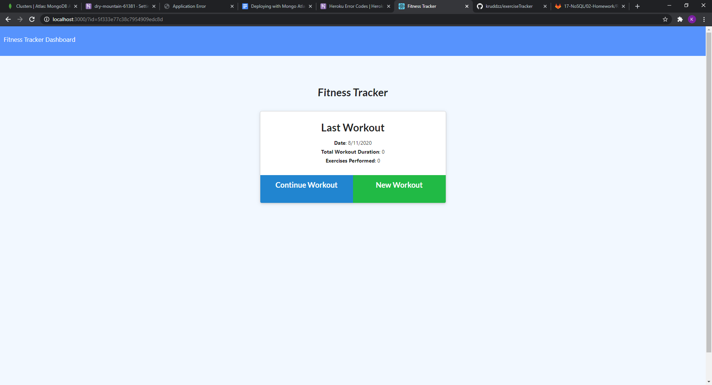
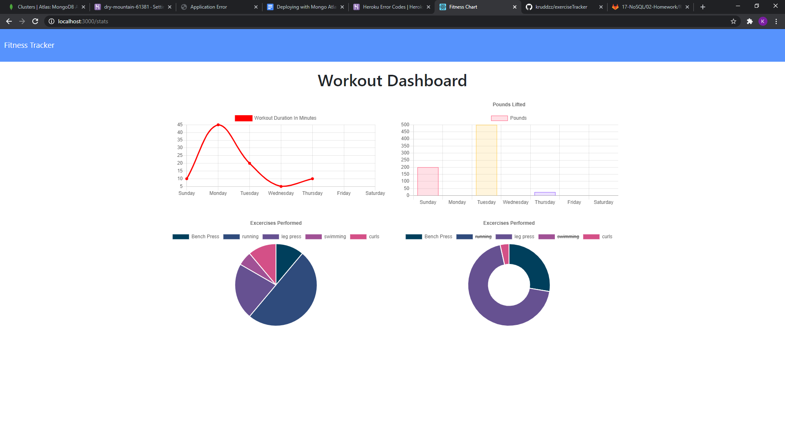

  

  # Project Title: Exercise Tracker

  ## Project Description:
 
When the user loads the page, they should be given the option to create a new workout, or continue with their last workout.
The user should be able to:

Add exercises to a previous workout plan.

Add new exercises to a new workout plan.

View multiple the combined weight of multiple exercises on the stats page.

  ## Table of Contents
  * [Installation](#installation)
  * [Usage](#usage)
  * [License](#license)
  * [Credits](#credits)
  * [Contributors](#contributors)
  * [Test](#test)
  * [Screenshot](#screenshot)
  * [Video](#video)
  * [Questions](#questions)
  * [Badges](#badges)
  
  ## Installation:
 
  You would need to clone or fork the repo. then you woud need to run npm i, npm i express.

  ## Usage:
 
  after everything is forked and installed you would need to run nodemon server.js and that will let you know the server is working. Then in the web browser of your chioce type in localhost:3000. That should pull up the app. The Make exercise routines and track rountines on graphs or you can go to the apps heroku link below.

  ## License:
  

  ## Credits:

  Kyle Rudderforth: https://github.com/kruddzz/exerciseTracker
   
       Heroku Link: https://dry-mountain-61381.herokuapp.com/
  
  ## Contributors:
  
  none

  ## Test:
   
  none

  ## Screenshot:

  
  

  ## Video

  

  ## Questions:
  
  You can reach out to me useing other my email or github profile.
  
  Email: kruddzz@gmail.com
  
  Git Hub Profile: https://github.com/kruddzz

  ## Badges:
  
  
